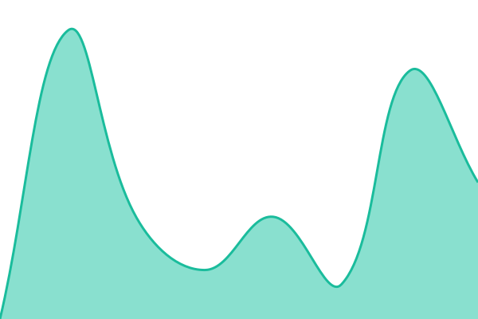
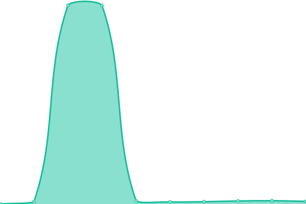

# [📈 Live Status](https://status.taoky.moe): <!--live status--> **🟩 All systems operational**

This repository contains the open-source uptime monitor and status page for [taoky](https://taoky.moe), powered by [Upptime](https://github.com/upptime/upptime).

With [Upptime](https://upptime.js.org), you can get your own unlimited and free uptime monitor and status page, powered entirely by a GitHub repository. We use [Issues](https://github.com/taoky/sites-status/issues) as incident reports, [Actions](https://github.com/taoky/sites-status/actions) as uptime monitors, and [Pages](https://status.taoky.moe) for the status page.

<!--start: status pages-->
<!-- This summary is generated by Upptime (https://github.com/upptime/upptime) -->
<!-- Do not edit this manually, your changes will be overwritten -->
<!-- prettier-ignore -->
| URL | Status | History | Response Time | Uptime |
| --- | ------ | ------- | ------------- | ------ |
|  [USTC](https://www.ustc.edu.cn) | 🟩 Up | [ustc.yml](https://github.com/littlekud/sites-status/commits/HEAD/history/ustc.yml) | 

 1576ms
     
 | 

<a href="https://status.taoky.moe/history/ustc">100.00%</a>
    

|  [Homepage](https://taoky.moe) | 🟩 Up | [homepage.yml](https://github.com/littlekud/sites-status/commits/HEAD/history/homepage.yml) | 

 397ms
     
 | 

<a href="https://status.taoky.moe/history/homepage">100.00%</a>
    

|  [Static files of taoky.moe](https://static.taoky.moe) | 🟩 Up | [static-files-of-taoky-moe.yml](https://github.com/littlekud/sites-status/commits/HEAD/history/static-files-of-taoky-moe.yml) | 

 504ms
     
 | 

<a href="https://status.taoky.moe/history/static-files-of-taoky-moe">100.00%</a>
    

|  [USTCLUG](https://lug.ustc.edu.cn) | 🟩 Up | [ustclug.yml](https://github.com/littlekud/sites-status/commits/HEAD/history/ustclug.yml) | 

 2299ms
     
 | 

<a href="https://status.taoky.moe/history/ustclug">100.00%</a>
    

|  [USTC Mirrors (IPv4)](https://ipv4.mirrors.ustc.edu.cn) | 🟩 Up | [ustc-mirrors-i-pv4.yml](https://github.com/littlekud/sites-status/commits/HEAD/history/ustc-mirrors-i-pv4.yml) | 

 2661ms
     
 | 

<a href="https://status.taoky.moe/history/ustc-mirrors-i-pv4">99.21%</a>
    

|  [USTC Mirrors (Cernet)](https://cernet.mirrors.ustc.edu.cn) | 🟩 Up | [ustc-mirrors-cernet.yml](https://github.com/littlekud/sites-status/commits/HEAD/history/ustc-mirrors-cernet.yml) | 

 2976ms
     
 | 

<a href="https://status.taoky.moe/history/ustc-mirrors-cernet">99.70%</a>
    

|  [USTC Mirrors (Chinanet)](https://chinanet.mirrors.ustc.edu.cn) | 🟩 Up | [ustc-mirrors-chinanet.yml](https://github.com/littlekud/sites-status/commits/HEAD/history/ustc-mirrors-chinanet.yml) | 

 2906ms
     
 | 

<a href="https://status.taoky.moe/history/ustc-mirrors-chinanet">97.61%</a>
    

|  [USTC Mirrors (Unicom)](https://unicom.mirrors.ustc.edu.cn) | 🟩 Up | [ustc-mirrors-unicom.yml](https://github.com/littlekud/sites-status/commits/HEAD/history/ustc-mirrors-unicom.yml) | 

 2196ms
     
 | 

<a href="https://status.taoky.moe/history/ustc-mirrors-unicom">99.65%</a>
    

|  [USTC Mirrors (Cmcc)](https://cmcc.mirrors.ustc.edu.cn) | 🟩 Up | [ustc-mirrors-cmcc.yml](https://github.com/littlekud/sites-status/commits/HEAD/history/ustc-mirrors-cmcc.yml) | 

 2022ms
     
 | 

<a href="https://status.taoky.moe/history/ustc-mirrors-cmcc">98.57%</a>
    

|  [USTC Mirrors (mirrors2 server)](https://mirrors.ustc.edu.cn/ubuntu-old-releases/) | 🟩 Up | [ustc-mirrors-mirrors2-server.yml](https://github.com/littlekud/sites-status/commits/HEAD/history/ustc-mirrors-mirrors2-server.yml) | 

 1266ms
     
 | 

<a href="https://status.taoky.moe/history/ustc-mirrors-mirrors2-server">100.00%</a>
    

|  [LUG GitLab](https://git.lug.ustc.edu.cn) | 🟩 Up | [lug-git-lab.yml](https://github.com/littlekud/sites-status/commits/HEAD/history/lug-git-lab.yml) | 

 2689ms
     
 | 

<a href="https://status.taoky.moe/history/lug-git-lab">100.00%</a>
    

|  [LUG FTP](http://ftp.lug.ustc.edu.cn) | 🟩 Up | [lug-ftp.yml](https://github.com/littlekud/sites-status/commits/HEAD/history/lug-ftp.yml) | 

 1246ms
     
 | 

<a href="https://status.taoky.moe/history/lug-ftp">100.00%</a>
    

|  [proxy.ustclug.org](https://openwrt.proxy.ustclug.org) | 🟩 Up | [proxy-ustclug-org.yml](https://github.com/littlekud/sites-status/commits/HEAD/history/proxy-ustclug-org.yml) | 

 1489ms
     
 | 

<a href="https://status.taoky.moe/history/proxy-ustclug-org">100.00%</a>
    

|  [USTC Vlab](https://vlab.ustc.edu.cn) | 🟩 Up | [ustc-vlab.yml](https://github.com/littlekud/sites-status/commits/HEAD/history/ustc-vlab.yml) | 

 1208ms
     
 | 

<a href="https://status.taoky.moe/history/ustc-vlab">100.00%</a>
    

|  [iCourse](https://icourse.club) | 🟩 Up | [i-course.yml](https://github.com/littlekud/sites-status/commits/HEAD/history/i-course.yml) | 

 285ms
     
 | 

<a href="https://status.taoky.moe/history/i-course">100.00%</a>
    

|  [MirrorZ 302 service](https://mirrors.cernet.edu.cn/api/scoring) | 🟩 Up | [mirror-z-302-service.yml](https://github.com/littlekud/sites-status/commits/HEAD/history/mirror-z-302-service.yml) | 

 1564ms
     
 | 

<a href="https://status.taoky.moe/history/mirror-z-302-service">100.00%</a>
    

<!--end: status pages-->

[**Visit our status website →**](https://status.taoky.moe)

## 📄 License

- Code: [MIT](./LICENSE) © [taoky](https://taoky.moe)
- Data in the `./history` directory: [Open Database License](https://opendatacommons.org/licenses/odbl/1-0/)
