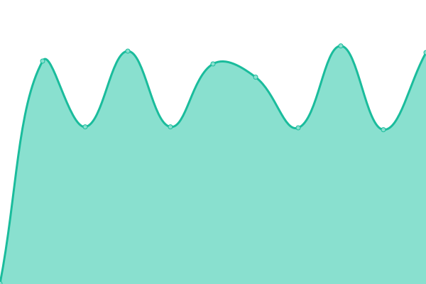

# [📈 Live Status](https://status.taoky.moe): <!--live status--> **🟩 All systems operational**

This repository contains the open-source uptime monitor and status page for [taoky](https://taoky.moe), powered by [Upptime](https://github.com/upptime/upptime).

With [Upptime](https://upptime.js.org), you can get your own unlimited and free uptime monitor and status page, powered entirely by a GitHub repository. We use [Issues](https://github.com/taoky/sites-status/issues) as incident reports, [Actions](https://github.com/taoky/sites-status/actions) as uptime monitors, and [Pages](https://status.taoky.moe) for the status page.

<!--start: status pages-->
<!-- This summary is generated by Upptime (https://github.com/upptime/upptime) -->
<!-- Do not edit this manually, your changes will be overwritten -->
<!-- prettier-ignore -->
| URL | Status | History | Response Time | Uptime |
| --- | ------ | ------- | ------------- | ------ |
| [USTC](https://www.ustc.edu.cn) | 🟩 Up | [ustc.yml](https://github.com/littlekud/sites-status/commits/master/history/ustc.yml) | 

 1856ms
     
 | 

   

| [Homepage](https://taoky.moe) | 🟩 Up | [homepage.yml](https://github.com/littlekud/sites-status/commits/master/history/homepage.yml) | 

 446ms
     
 | 

   

| [Static files of taoky.moe](https://static.taoky.moe) | 🟩 Up | [static-files-of-taoky-moe.yml](https://github.com/littlekud/sites-status/commits/master/history/static-files-of-taoky-moe.yml) | 

 413ms
     
 | 

   

| [USTCLUG](https://lug.ustc.edu.cn) | 🟩 Up | [ustclug.yml](https://github.com/littlekud/sites-status/commits/master/history/ustclug.yml) | 

 2410ms
     
 | 

   

| [USTC Mirrors](https://mirrors.ustc.edu.cn) | 🟩 Up | [ustc-mirrors.yml](https://github.com/littlekud/sites-status/commits/master/history/ustc-mirrors.yml) | 

 2343ms
     
 | 

   

| [LUG GitLab](https://git.lug.ustc.edu.cn) | 🟩 Up | [lug-git-lab.yml](https://github.com/littlekud/sites-status/commits/master/history/lug-git-lab.yml) | 

 2865ms
     
 | 

   

| [LUG FTP](https://ftp.lug.ustc.edu.cn) | 🟩 Up | [lug-ftp.yml](https://github.com/littlekud/sites-status/commits/master/history/lug-ftp.yml) | 

 2419ms
     
 | 

   

| [proxy.ustclug.org](https://openwrt.proxy.ustclug.org) | 🟩 Up | [proxy-ustclug-org.yml](https://github.com/littlekud/sites-status/commits/master/history/proxy-ustclug-org.yml) | 

 965ms
     
 | 

   

<!--end: status pages-->

[**Visit our status website →**](https://status.taoky.moe)

## 📄 License

- Code: [MIT](./LICENSE) © [taoky](https://taoky.moe)
- Data in the `./history` directory: [Open Database License](https://opendatacommons.org/licenses/odbl/1-0/)
