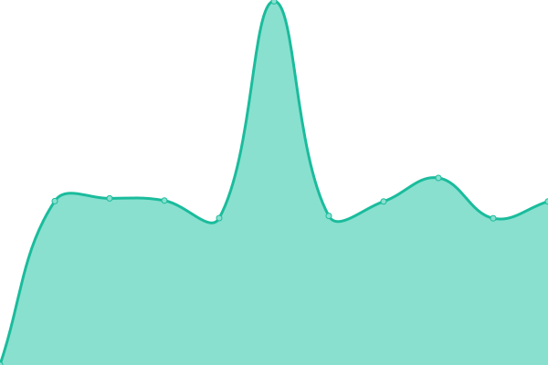

# [📈 Live Status](https://status.taoky.moe): <!--live status--> **🟩 All systems operational**

This repository contains the open-source uptime monitor and status page for [taoky](https://taoky.moe), powered by [Upptime](https://github.com/upptime/upptime).

With [Upptime](https://upptime.js.org), you can get your own unlimited and free uptime monitor and status page, powered entirely by a GitHub repository. We use [Issues](https://github.com/taoky/sites-status/issues) as incident reports, [Actions](https://github.com/taoky/sites-status/actions) as uptime monitors, and [Pages](https://status.taoky.moe) for the status page.

<!--start: status pages-->
<!-- This summary is generated by Upptime (https://github.com/upptime/upptime) -->
<!-- Do not edit this manually, your changes will be overwritten -->

| URL                                                    | Status | History                                                                                                                         | Response Time                                                                                  | Uptime                                                                                                                                                                                                                                           |
| ------------------------------------------------------ | ------ | ------------------------------------------------------------------------------------------------------------------------------- | ---------------------------------------------------------------------------------------------- | ------------------------------------------------------------------------------------------------------------------------------------------------------------------------------------------------------------------------------------------------ |
| [USTC](https://www.ustc.edu.cn)                        | 🟩 Up  | [ustc.yml](https://github.com/littlekud/sites-status/commits/master/history/ustc.yml)                                           |  1482ms                     |                                            |
| [Homepage](https://taoky.moe)                          | 🟩 Up  | [homepage.yml](https://github.com/littlekud/sites-status/commits/master/history/homepage.yml)                                   |  486ms                  |                                    |
| [Static files of taoky.moe](https://static.taoky.moe)  | 🟩 Up  | [static-files-of-taoky-moe.yml](https://github.com/littlekud/sites-status/commits/master/history/static-files-of-taoky-moe.yml) |  425ms |  |
| [USTCLUG](https://lug.ustc.edu.cn)                     | 🟩 Up  | [ustclug.yml](https://github.com/littlekud/sites-status/commits/master/history/ustclug.yml)                                     |  2040ms                  |                                       |
| [USTC Mirrors](https://mirrors.ustc.edu.cn)            | 🟩 Up  | [ustc-mirrors.yml](https://github.com/littlekud/sites-status/commits/master/history/ustc-mirrors.yml)                           |  1905ms             |                             |
| [LUG GitLab](https://git.lug.ustc.edu.cn)              | 🟩 Up  | [lug-git-lab.yml](https://github.com/littlekud/sites-status/commits/master/history/lug-git-lab.yml)                             |  2651ms              |                              |
| [LUG FTP](https://ftp.lug.ustc.edu.cn)                 | 🟩 Up  | [lug-ftp.yml](https://github.com/littlekud/sites-status/commits/master/history/lug-ftp.yml)                                     |  2185ms                  |                                      |
| [proxy.ustclug.org](https://openwrt.proxy.ustclug.org) | 🟩 Up  | [proxy-ustclug-org.yml](https://github.com/littlekud/sites-status/commits/master/history/proxy-ustclug-org.yml)                 |  1006ms        |                  |

<!--end: status pages-->

[**Visit our status website →**](https://status.taoky.moe)

## 📄 License

- Code: [MIT](./LICENSE) © [taoky](https://taoky.moe)
- Data in the `./history` directory: [Open Database License](https://opendatacommons.org/licenses/odbl/1-0/)
